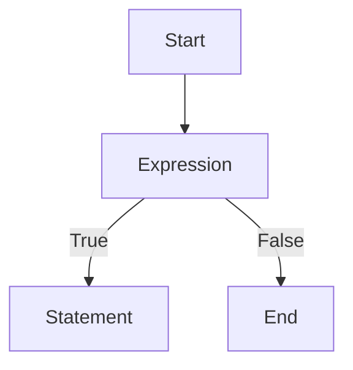

# python笔记-语句和文件                      <sub>  —storm</sub>

## charpter 2 语句和文件

### 2.1 运算符

#### 2.1.1 算术运算符

四则运算中的一些运算符，如加减乘除，对应的符号分别是：+、-、*、/，此外，还有求余的%等，都是算术运算符。

| 运算符 |                      描述                      |       实例        |
| :----: | :--------------------------------------------: | :---------------: |
|   +    |               加，两个 对象相加                | 10+20 输出结果 30 |
|   --   |     减，得到负数或者是一个数减去另外一个数     | 10-20 输出结果-10 |
|   *    | 乘，两个数相乘或是返回一个被重复若干次的字符串 | 10*20 输出结果200 |
|   /    |                   除，x除以y                   |  20/10 输出结果2  |
|   %    |              取余，返回除法的余数              |  20%10 输出结果0  |
|   **   |                幂，返回x的y次幂                | 10**2 输出结果200 |
|   //   |            取整数，返回商的整数部分            |  9//2 输出结果4   |

#### 2.1.2 比较运算符

| 运算符 |          描述          |       实例        |
| :----: | :--------------------: | :---------------: |
|   ==   | 等于（注意：两个等号） | （a==b）返回False |
|   !=   |         不等于         | （a!=b）返回True  |
|   >    |          大于          | （a>b）返回False  |
|   <    |          小于          |  （a<b）返回True  |
|   >=   |        大于等于        | （a>=b）返回False |
|   <=   |        小于等于        | （a<=b）返回True  |

注：以上假设a=10,b=20。

除了数字之外，还可以对字符串进行比较。字符串中的比较是按照“字典顺序”进行比较的，当然，这里说的是英文的字典。

python中，某些两种不同类型的对象，虽然可以进行比较，但是不赞成这样进行比较 。

#### 2.1.3 逻辑运算符

1. 布尔类型的变量

在所有的高级编程语言中都有一类对象类型，被称之为布尔型。

布尔所创立的逻辑被称之为“布尔代数”，其中规定只有两种值，True和False,正好对应计算机上二进制数的1和0。布尔类型就是返回1（True）或0(False)的数据变量。

2. 布尔运算

| 运算符 |   描述   |                         实例                          |
| :----: | :------: | :---------------------------------------------------: |
|  and   |   “与”   |   如果x为False，x and y， 返回False，否则返回y的值    |
|   or   |   “或“   |       如果x是True，返回True，否则返回y的计算值        |
|  not   | 布尔”非“ | 如果x为True，not x，返回 False。如果x为False,返回True |

(1) and

and，翻译为“与”，但事实上，这种翻译容易引起望文生义的理解。先说一下正确
的理解。A and B，含义是：首先运算A，如果A的值是True，就计算B，并将B的结果返回做为最终结果（如果B是False，那么A and B的最终结果就是False，如果B的结果是True，那么A and B的结果就是True）；如果A的值是False，就不计算B了，直接返回False作为A and B的结果。

```python
>>>4>3 and 4<9
True
>>>4>3 and 4<2
False
>>>4<3 and  4<2
False
```

前面说容易引起望文生义的理解，就是有很多人认为无论什么时候都看and两边的
值，若值都是True则返回True，若有一个是False就返回False。根据这种理解得到的结果与前述理解得到的结果一样，但是，运算量不一样。

(2) or

or，翻译为“或”。在A or B 中，它是这么运算的：

```python
>>> if a==True: #如果a的值是True
    return True #返回True，表达式最终结果是True
else:           #否则，也就是a的值不是True
    return b    #看b的值，然后就返回b的值作为最终结果
```

上面这段是伪代码，所谓伪代码，就不是真正的代码，无法运行。但是，伪代码也有用途，就是能够以类似代码的方式表达一种计算过程。

```python
>>> 4<3 or 4<9
True
>>>4<3 or 4>9
False
```

(3) not

not, 翻译成“非 ”，不论面对什么，就是要否定它。

```python
>>>not (4>3)
False
```

### 2.2  简单语句

在编程语句中，句子被称之为“语句”。

> 命令式编程：是一种描述电脑所需做出的行为的编程范型。几乎所有电脑的硬件工作都是指令式的；几乎所有电脑的硬件都是设计来运行机器码，使用指令式的风格来写的。较高级的指令式编程语言使用变量和更复杂的语句，但仍依从相同的范型。
>
> 运算语句一般来说都表现了在存储器内的数据进行运算的行为，然后将结果存入存储器中以便日后使用。高级命令式编程语言更能处理复杂的表达式，可能会产生四运算和函数计算的结合。

一般高级语言都包含如下语句，python也不例外。

- 循环语句：容许一些语句反复运行数次。可依据一个默认的数目来决定运行这些语句的执行次数；或反复运行它们，直至某些条件改变。
- 条件语句：容许仅当某些条件成立时才运行某个模块。否则，这个区块中的语句会略去，然后按区块后的语句继续运行。
- 无条件分支语句：容许运行顺序转移到程序的其他部分之中。包括跳跃（在很多语言中称为goto）、副程序和procedure等。

循环、条件分支和无条件分支都是控制流程。

#### 2.2.1 print

```python
>>>print('hello, world') #一个字符串
hello, world
>>>print('hello','world') #两个字符串
hello world
```

==本来，在print语句中，字符串后面会接一个\n符号，即换行。但是，如果要在一个字符串后面跟着逗号，那么换行就取消了，意味着两个字符串“hello”和“world”打印在同一行。==

```python
>>>for i in [1,2,3,4,5]:
	print(i)	
1
2
3
4
5
```

这个循环的意思就是要从列表中依次取出每个元素，然后赋值给变量i，并用print
语句打印打出来。在变量i后面没有任何符号，每打印一个就换行，再打印下一个，这就是那个“\n”起的作用。

```python
>>>for i in [1,2,3,4,5]
	print(i,end='')
12345
```

将print()函数的end修改成''就可以1行输出了。

#### 2.2.2 import

import引入模块（或者包、库）的方法是python编程经常用到的。引入方法有如下几种：

```python
>>>import math
>>>math.pow(3,2)
9.0
```

这个方式是一种可读性非常好的引用方式，并且不同模块的同名函数不会产生冲突。

```python
>>>from math import pow
>>>pow(3,2)
9.0
```

这种引用方式适合于引入模块较少的时候。如果引入模块多了，可读性就下降了，不知道哪个函数来自哪个模块。

```python
>>>from math import pow as pingfang
>>>pingfang(3,2)
9.0
```

对引入的模块进行重命名。

```python
>>>from math import pow,e,pi
>>>pow(e,pi)
```

从一个模块引入多个函数。

```python
>>>from math import  *
>>>pow(3,2)
9.0
>>>sqrt(9)
3.0
```

引入一个模块的所有函数。

#### 2.2.3 赋值

```python
>>>x,y,z=1,'python',[1,2]
```

```python
>>>a='world','python'
```

```python
>>>a,b=3,2
>>>a,b=b,a
>>>a
2
>>>b
3
```

```python
>>>m=n='python'
>>>m is n #检查两个变量所指向的值是否是同一个（id）
True
```

链式赋值，m，n的ID一致。变量值相等，id不一定一致。

```python
>>>x=9
>>>x+=1
>>>x
10
>>>m='py'
>>>m+='th' #增量赋值也适用与字符串
>>>m
'pyth'
```

### 2.3 条件语句

#### 2.3.1 if语句

if 语句是由if发起的一个语句，即if发起是一个条件，在满足条件后执行相应内容。if这个单词就是构成条件语句的关键词。

```python
>>>a=8
>>>if a==8:
    print a
```

冒号 :是必须的，缩进也是必须的。

> 根据PEP的规定，必须使用四个空格来表示每级缩排。使用Tab字符和其他数目的空格虽然都可以编译通过，但不符合编码规范。支持Tab字符和其他数目的空格仅仅是为兼容很旧的Python程序和某些有问题的编辑程序。

- 必须要有缩进方式表示语句块的开始和结束。
- 缩进用四个空格（也是必需的，别的方式也许也可以，但不提倡）

#### 2.3.2 if……elif……else

在进行条件判断时，只有if往往是不够的。为了解决多分支的问题，就引入了另外一种条件判断：if...elif...else语句。

```python
>>>if condition1:
    	clause 1
    elif condition2:
        clause2
    else:
        clause3
    
```

```python
>>>a=eval(input())#eval可以将input中的内容转变成有效的表达式
>>>if a == 10:
    	print('您输入的数字是{}'.format(a))
    else:
        print('nothing')   
```

在条件a == 10，为了方便阅读，在a和==之间最好有一个空格，同理，在后面也应该有一个。

> 在“条件”语句中，就是前面已经提到的各种条件运算表达式，如果是True，就执行该条件下的语句。

#### 2.3.3 三元操作符

三元操作，是条件语句中比较简练的一种赋值方式，它的模式是这样的：

```python
>>>name='a' if 'b' else 'c' #A=Y if x else Z
```

- 如果X为真，那么就执行A=Y。
- 如果X为假，那么就执行A=Z。

```python
>>>x,y=2,8
>>>a='python' if x > y else 'world'
>>>a
'world'
>>>a='python' if x < y else 'world'
>>>a
'world'
```

### 2.4 for  循环

在python中，循环之一：for 循环。

for 循环的基本结构 ：

```python
>>>for 循环规则:
       操作语句
```

从基本结构上看，其有着同if条件语句类似的地方：都有冒号；语句块都要缩进。

#### 2.4.1 简单的for循环

```python
>>>a='hello'
>>>for i in a:
	print(i)
h
e
l
l
o
```

- a这个变量引用的是‘hello'这个字符串类型的数据；
- 变量i通过a找到它所引用的对象‘hello’,因为字符串类型属于序列类型，能够进行 索引，于是就按照索引顺序，从第一个字符开始，依次获得该字符。
- 当i='h'的时候，执行print(i)，打印出了字母h,结束之后循环第二次，让i='e'，然后执行print(i)，打印出字母e。如此循环下去，一直到最后一个字符被打印出来 ，循环自动结束。注意，每次打印之后要换行。

因为也可以通过索引（偏移量）得到序列对象的某个元素，所以，还可以通过下面的循环方式实现同样的效果：

```python
>>>a='world'
>>>for i in range(len(a)):
    print(a[i])
w
o
r
l
d
```

其工作方式是：

- len(a)得到a引用的字符串的长度，为5。
- range(len(a))就是range(5)，也就是[0,1,2,3,4]，对应着“world”的每个字母索引，也可以称之为偏移量。
- for i in range(len(a))就相当于for i in[0,1,2,3,4]，让i依次等于list中的各个值。当i=0时，打印a[0]，也就是第一个字符。然后顺序循环下去，直到最后一个i=4为止。

> 以上的循环举例中，显示了对字符串的字符依次获取，同时涉及了列表。

```python
>>>a=['a','bc','d']
>>>for word in a:
    print(world)
a
bc
d
>>>for i in range(len(a)):
    print(a[i])
a
bc
d
```

#### 2.4.2 range(start,stop[,step])

range()是一个内建函数，一般形式是range(start,stop[,step])。

- 这个函数可以创建一个数字元素组成的列表。
- 这个函数最常用于for循环。
- 函数的参数必须是整数，默认从0开始。返回值是类似[start,start+step,start+2*step,...]的列表。
- step默认值是1。如果不写那就是按照此值。
- 如果step是正数，返回list的最后的值不包含stop值，即start+istep这个值小于stop；如果step是负数，start+istep的值大于stop。
- step不能等于零，如果等于零，就报错。
  - start：开始数值，默认为0，即如果不写这项，就默认start=0.
  - stop：结束的数值，必须要写。
  - step：变化的步长，默认是1,即若不写则认为步长为1，坚决不能为0。

```python
>>>range(9) #stop=9,别的都没写，含义就是range(0,9,1)
[0,1,2,3,4,5,6,7,8]#从0开始，步长为1，直到小于9的那个数
>>>range(0,9)
[0,1,2,3,4,5,6,7,8]
>>>range(1,9) #start=1
[1,2,3,4,5,6,7,8]
>>>range(0,9,2) #step=2
[0,2,4,6,8]
>>>range(-9)  #
>>>list(range(0,-9)) #不报错，返回空列表
[]
>>>range(0,-9,-1)
[0,-1,-2,-3,-4,-5,-6,-7,-8]
```

思考一个问题，现在有一个列表，比如是["a"，"b"，"c"，"d"，"e"，"f"]，要得到这个列表的索引值组成的列表，但是不能一个一个用手指头来数。怎么办？

```python
>>>a=["a"，"b"，"c"，"d"，"e"，"f"]
>>>a_index=range(len(a))
>>>a_index
[0,1,2,3,4,5]
```

例:找出100以内的能够被3整除的正整数。

```python
>>>a=[]
>>>for n in range(1,100):
    if n % 3 ==0:
        a.append(n)
>>>print(a)
>>>range(3,100,3)
```

#### 2.4.3 for的对象

所有的序列类型对象都能够用for循环。

```python
>>>a=['python']
>>>for i in a:
    print(i,end='')
p y t h o n
>>>b=list(a)
>>>b
['p','y','t','h','o','n']
>>>for i in b:
    print(i,end='')
p y t h o n
>>>c=set(b)
>>>c
{'p', 'o', 'h', 'y', 't', 'n'}
>>>for i in c:
    print(i,end='')
p y t h o n
>>>d=tuple(c)
>>>d
('p', 'o', 'h', 'y', 't', 'n')
>>>for i in d:
    print(i,end='')
p y t h o n
>>>e={'a':1,'b':2,'c':3}
>>>for i in e:
    print(i,'-->',e[i])
a --> 1
b --> 2
c --> 3
```

用for循环读取字典“键/值”对需要多说几句。

`e={'a':1,'b':2,'c':3}`

获得字典键、值的函数有：items/iteritems/keys/iterkeys/values/itervalues，通过这些函数得到的是键或者值的列表。

```python
>>>e={'a':1,'b':2,'c':3}
>>>for i in e:
    print(i,e[i])
a 1
b 2
c 3
```

下列两种方法也可以实现同样的效果：

```python
>>>e={'a':1,'b':2,'c':3}
>>>for m,n in e.items():
    print(m,n)
a 1
b 2
c 3
>>>for m,n in e.iteritems(): #效率高
    print(m,n)
a 1
b 2
c 3
```

单取values的方法：

```python
>>>e={'a':1,'b':2,'c':3}
>>>for m in e.values():
    print(m)
1
2
3
>>>for m in e.itervalues():
    print(m)
1
2
3
```

#### 2.4.4 zip()

迭代在python中的表现就是用for循环，从序列对象中获得一定数量的元素。

用for循环来获得列表、字符串、元组，乃至于字典的键\值对都是迭代。

问题：有两个列表，分别是：a=[1，2，3，4，5]，b=[9，8，7，6，5]，要计算这
两个列表中对应元素的和。

```python
>>>a=[1,2,3,4,5]
>>>b=[9,8,7,6,5]
>>>c=[]
>>>for i in range(len(a)):
    c.append(a[i]+b[i])
>>>c
[10,10,10,10,10]
```

```python
>>>a='python'
>>>b='worldi'
>>>zip(a,b)
[('p','w'),('y','o'),('t','r'),('h','l'),('o','d'),('n','i')]
>>>a=[1,2,3]
>>>b=[3,4]
>>>zip(a,b) #以序列长度最短的那个为准
[(1,3),(2,4)]
>>>a={'a','b'}
>>>b={'c','d'}
>>>zip(a,b) #集合无序类型
[('a','d'),('b','c')]
>>>m={'a':1}
>>>n={'b':1}
>>>zip(m,n)
[('a','b')]
```

zip()是一个内置函数，它的参数必须是某种序列数据类型，如果是字典，那么视为序列。然后将序列对应的元素依次组成元组，并单做列表中的元素。

```python
>>>a='world'
>>>x=[1,2,3]
>>>zip(x)
[(1,),(2,),(3,)]
```

因为只提供了一个参数，那么列表中的元组就一个元素，此时元组中的元素后面要有一个逗号（半角的）。

```python
>>>a=[1,2,3,4,5]
>>>b=[9,8,7,6,5]
>>>c=[]
>>>for x,y in zip(a+b):
    c.append(x+y)
>>>c
[10,10,10,10,10]
```

例子：给定两个已知的列表，要将对应的元素“加起来”。

```python
>>>a=[1,2,3,4,5]
>>>b=['a','b','c']
>>>length=len(a) if len(a)<len(b) else len(b)
>>>c=[]
>>>for i in range(length):
    c.append(str(a[i])+':'+b[i]) #只能连接字符串类型
['1:a','2:b','3:c']
```

zip方法

```python
>>>a=[1,2,3,4,5]
>>>b=['a','b','c']
>>>c=[]
>>>for  x,y in zip(a,b):
    c.append(str(x)+':'+y)
['1:a','2:b','3:c']
```

延伸问题：

如果将字典的键值互换？

```python
>>>a={'a':1,'b':2,'c':3}
>>>b={}
>>>for m,n in a.items():
    b[n]=m
{1: 'a', 2: 'b', 3: 'c'}    
```

```python
>>>a={'a':1,'b':2,'c':3}
>>>b=dict(zip(a.values(),a.keys()))
>>>b
{1: 'a', 2: 'b', 3: 'c'} 
```

#### 2.4.5 enumerate()

> 本来可以通过for i in range（len（list））的方式得到一个list的每个元素索引，然后再用list[i]的方式得到该元素。如果要同时得到元素索引和元素怎么办？可以这样：

```python
>>>a=['a','b','c','d']
>>>for i in range(len(a)):
    print(a[i]+' is '+str(i))
a is 0
b is 1
c is 2
d is 3
```

> python 中提供了一个内置函数enumerate，能够实现类似的功能。

```python
>>>a=['a','b','c','d']
>>>for m,n in enumerate(a):
    print(n+' is '+str(m))
a is 0
b is 1
c is 2
d is 3   
```

```python
>>>a=['a','b','c','d']
>>>list(enumerate(a))
[(0, 'a'), (1, 'b'), (2, 'c'), (3, 'd')]
>>>list(enumerate(a,start=1))
[(1, 'a'), (2, 'b'), (3, 'c'), (4, 'd')]
```

```python
>>>a=['a','b','c']
>>>d=enumerate(a)
<enumerate object at 0x000001EC23F2FB88>
>>>list(d)
[(0, 'a'), (1, 'b'), (2, 'c')]
```

小练习

```python
>>>a='do you love wm? wm is a beautiful girl'
>>>b=a.split(" ")
>>>for m,n in enumerate(b):
    if n=='wm'
        b[m]='meng'
>>>b
['do', 'you', 'love', 'wbm?', 'meng', 'is', 'a', 'beautiful', 'girl']
>>>for m,n in enumerate(b):
    if 'wm' in n:
        b[m]='meng'
>>>b
['do', 'you', 'love', 'meng?', 'meng', 'is', 'a', 'beautiful', 'girl']
>>>c=(' ').join(b)
'do you love meng meng is a beautiful girl'
```

#### 2.4.6 列表解析

```python
>>>pow=[]
>>>for i in range(1,10):
    pow.append(i*i)
>>>pow
[1, 4, 9, 16, 25, 36, 49, 64, 81]
>>>pow2=[x**2 for x in range(1,10)] #列表解析
>>>pow2
[1, 4, 9, 16, 25, 36, 49, 64, 81]
```

```python
>>>a=[' a ',' b ',' c ']
>>>[one.strip() for one in a ] #去掉元素前后的空格
['a', 'b', 'c']
```

list解析的执行效率高，代码简洁明了，在实际写程序中经常会用到。

### 2.5while循环 

>while，翻译成中文是“当……的时候”，这个单词在英语中常常用来作为时间状
>语，while...someone do somthing，这种类型的说法是有的。在Python中，它也有这个含义，区别是“当……时候”这个条件成立在一段范围或者时间间隔内，从而在这段时间间隔内让Python做好多事情。就好比这样一段情景：

****

while 年龄大于60岁：  #当年龄大于60岁的时候

​	退休                            #凡是符合上述条件就执行的动作

****



#### 2.5.1 猜数字游戏 

```python
>>>import  random
>>>i=0
>>>while i < 4:
    print('*'*20)
    num=eval(input('请输入0到9的任意一个数：'))
    a=random.randint(0,9)
    x=3-i
    if num==a::
    	print('运气真好，您猜对了！')
    	break
     elif num>a:
        print('您猜大了！\n哈哈，正确答案是：{}\n,您还有{}次机\会！'.format(num,x))
     elif num<a:
        print('您猜小了！\n哈哈，正确答案是：{}\n,您还有{}次机\会！'.format(num,x))
     i+=1     
```

> ==任何用户输入的内容都是不可靠的。==

```python
>>>import random
>>>num=random.randint(1,101)
>>>i=0
>>>while True:
    a=eval(input('请输入1到100的整数：'))
    i+=1
    if not a.isdigit(): #判断输入的是否是整数。
        print('please input interger:')
    elif a<0 or a>=100: #判断数字范围
        print('the range should be 1 to 100')
     else:
        if a==num:
            print('ok,you are good')
            break
         else:
            print('try again')  
```

#### 2.5.2 break 和continue

break的含义是要在这个地方中断循环，跳出循环体。

```python
>>>a=8
>>>while a:
        if a % 2==0:
            break
        else:
            print('{} is odd number'.format(a))
            a=0
   print('{} is even number '.format(a))
```

a=8的时候，执行循环体中的break跳出循环，执行最后的打印语句 ，得到结果;

****

`8 is even number`

****

如果a=9,则要执行else里面的print,然后a=0,循环就在执行一次，又break了 ，得到结果：

```python
9 is odd number
0 is even number
```

而continue则是要从当前位置（即continue所在的位置）跳到循环体的最后一行的后面（不执行最后一行），对一个循环体来讲，就如同首尾衔接一样，最后一行的后面是哪里呢？当然是开始了 。

```python
>>>a=9
while a:
    if a%2==0:
        a-=1
        continue #如果是偶数，就返回循环开始的地方
     else:
        print('{} is odd number'.format(a)) #如果是奇数，就打印出来 
        a-=1
```

#### 2.5.3 while...else

while...else 有点类似于if...else，只需要一个例子就理解了，当然，一遇到else,就意味着已经不在while循环内了 。

```python
>>>>count=0
>>>while count<5:
    print(count,'is less than 5')
    count+=1
   else:
    print(count,'is not less than 5')
```

#### 2.5.4 for...else

这个循环也通常用于跳出循环之后要做的事情。

```python
>>>from math import sqrt
>>>for n in range(99,1,-1):
    root=sqrt(n)
    if root==int(root):
        print(n)
    else:
        print('nothing')
```

### 2.6 文件

#### 2.6.1 打开文件

```python
>>>f=open('130.txt') #打开已经存在的文件
>>>for line in f:
    print(line)
```

> 将打开的文件赋值给变量f，这样就是变量f跟对象文件130.txt用线连起来了（对象引用），本质上跟前面所讲述的其他类型数据进行赋值是一样的。
> 接下来，用for来读取文件中的内容，就如同读取一个前面已经学过的序列对象一样，如列表、字符串、元组，将读到的文件中的每一行赋值给变量line。也可以理解，for循环是一行一行地读取文件内容。每次扫描一行，遇到行结束符号\n表示本行结束，然后是下一行。
> 从打印的结果可以看出，打印的每一行内容跟文件中每一行的内容是一样的，只是行与行之间多了个空行，前面显示文章内容的时候，并没有这个空行。或许这无关紧要，但是，还要深究一下才能豁然。
> 在原文中，每行结束都有结束符号\n，表示换行。在for语句汇总，print line表示每次打印完line的对象之后就换行，也就是打印完line的对象之后会增加一个\n。这样看来，在每行末尾就有两个\n，即：\n\n，于是在打印中就出现了一个空行。

```python
>>>f=open('130.txt')
>>>for line in f:
    print(line,end="") #将默认的\n换成空格，就不会换行了
```

> ==读取整个文件后，文件指针在末尾。==

#### 2.6.2 创建文件

```python
>>>nf=open('a.txt','w') #文件存在打开文件，文件不存在新建文件。
>>>nf.write('this is a new file')#写入新内容，会覆盖之前的内容。
```

| 模式 |                             描述                             |
| :--: | :----------------------------------------------------------: |
|  r   |               以读方式打开文件，可读取文件信息               |
|  w   | 以写方式打开文件，可向文件写入信息，如文件存在 ，则清空该文件，再写入新内容 |
|  a   | 以追加模式打开文件（打开文件，文件指针自动移到文件末尾），如果文件不存在则创建 |
|  r+  |          以读写方式打开文件，可对文件进行读和写操作          |
|  w+  |            消除文件内容，然后以读写方式 打开文件             |
|  a+  |          以读写方式打开文件，并把文件指针移到文件尾          |
|  b   | 以二进制模式打开文件，而不是以文本模式。该模式只对windows或dos有效，类unix的文件是用二进制模式进行操作的 |

==默认模式只读模式。==

#### 2.6.3 使用with

在对文件进行写入操作后，一定要牢记一件事：file.close(),这个操作千万不要忘记，若忘记了那就补上。

```python
>>>with open('a.txt','a') as f:
    f.write('this is good')
>>>with open('a.txt','r') as f:
    print(f.read())
```

with方法不需要关闭文件。

#### 2.6.4 文件的状态

有时候需要知道一个文件的有关状态（也称为属性），比如创建日期，访问日期，修改日期，大小等。在os模块中，有这样一个方法，专门让我们查看文件的这些状态参数。

```
>>>import os
>>>file_stat=os.stat('a.txt') #查看文件的状态
>>>file_stat.st_ctime #查看文件创建时间
```


