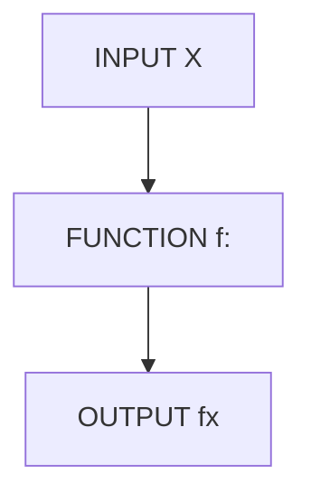

# python笔记-函数                       <sub> —storm</sub>



### 3.1 理解函数

在中学数学中，可以用这样的方式定义函数：y=4x+3，这就是一个一次函数，当 然，也可以写成：f（x）=4x+3。其中x是变量，它可以代表任何数。 

当x=2时，代入到上面的函数表达式：

 f（2）=4*2+3=11 

所以：f（2）=11

但是，这并不是函数的全部，其实在函数中，并没有规定变量只能是一个数，它 可以是馒头、还可以是苹果，不知道读者是否对函数有这个层次的理解，继续阅读会 理解更深刻。

#### 3.1.1 变量不仅仅是数

变量x只能是任意数吗？其实，一个函数，就是一个对应关系。读者尝试着将上面 表达式的x理解为馅饼，4x+3，就是4个馅饼加上3（一般来讲，单位是统一的，但你非 让它不统一也无妨），这个结果对应着另外一个东西，那个东西比如说是iPhone。或者 说可以理解为4个馅饼加3就对应一个iPhone，这就是所谓的映射关系。

 所以，x不仅仅是数，还可以是你认为的任何东西。

- 变量本质上是占位符

变量在本质上就是一个占位符，这是一针见血的理解。什么是占位符？就是先把那个位置用变量占上，表示这里有一个东西，至于这个位置放什么东西，以后再说， 反正先用一个符号占着这个位置（占位符）。
其实在高级语言编程中，变量比我们在初中数学中学习的要复杂。但是，先不管 那些，现在，就按照初中数学的难度来研究Python中的变量。 在Python中，通常用小写字母来命名变量，也可以在其中加上下划线，以表示区别。

#### 3.1.2 建立简单函数

```python
>>>a=2
>>>y=3*a+2
>>>y
8
>>>a=3
>>>y
8 ```？a=2的含义是将2这个对象贴上了变量a的标签，经过计算，得到了8，之后变量y引用了对象8。当变量a引用的对象 修改为3的时候，但是y引用的对象还没有变，所以还是8。再计算一次，y的连接对象 就变了：```
>>>y=3*a+2
>>>y
11
```

==如果函数中要使用某个变量，必须提前定义出来，定义方法就是给这个变量赋值。==

#### 3.1.3 建立使用的函数

****

```python
>>>def addfunction(a,b):
    c=a+b
    print(c)
>>>add_function(2,3)    
```

****

- def add_function(a,b): 这是函数的开始。在声明要建立一个函数的时候，一定要使用def(def就是英文define的前三个字母)，意思是先告知计算机，这里要声明一个函数;add_function是这个函数名称。在Python中取名字的讲究是要有一定意义，能够从名字中看出这个函数是用来干什么的。从add_function这个名字中，可以看出它是用来计算加法的（严格来说是把两个对象“相加”，这里相加的含义是比较宽泛的，包括对字符串等相加）。（a,b）这个括号里面的是这个函数的参数，也就是函数变量。冒号非常重要，如果少了，就会报错。冒号的意思是下面开始真正的函数内容了。
- c=a+b: 这一行比上一行要缩进四个空格，这是python的规定，要牢记，不可丢掉，丢了就报错。然后这句话即是要将两个参数相加，结果赋值给另外一个变量c。
- print(c):缩进四个空格。将得到的结果c的值打印出来。
- add_function(2,3):这才是真正调用前面建立的函数，并且传入两个参数：a=2，b=3。仔细观察传入参数的方法，就是把2放在a那个位置，3放在b那个位置。

定义函数的格式为：

****

def  函数名（参数1，参数2，...参数n）：

​     函数体（语句块）

****

几点说明：

- 函数名的命名规则要符合Python中的要求。一般小写字母和单下划线、数字等组合。
- def 是定义函数的关键词，这个来自英文单词define。
- 函数名后面是圆括号，括号里面，可以有参数列表，也可以没有参数。
- 千万不要忘记括号后面的冒号。
- 函数体（语句块），相对于def缩进，按照Python的习惯，缩进四个空格。

```python
>>>def name(): #定义一个无参数的函数
    print("world") #缩进四个空格
>>>name() #调用函数，打印结果
world
>>>def add(x,y): #定义一个非常简单的函数
    return x+y #缩进四个空格
>>>add(x+y) #计算2+3   
5
```

>注意上面的add（x，y）函数，没有特别规定参数“x，y”的类型。其实，这句话本身就是错的，前面已经多次提到，在Python中，变量无类型，只有对象才有类型，这句话应该说成：“x，y”并没有严格规定其所引用的对象类型。这是Python跟某些语言很大区别，在有些语言中，需要在定义函数的时候告诉函数参数的数据类型，Python不用那样做。
>
>为什么？读者不要忘记了，这里的所谓参数跟前面说的变量本质上是一回事。只有当用到该变量的时候，才建立变量与对象的对应关系，否则，关系不建立。只有对象才有类型，那么，在add（x，y）函数中，“x，y”在引用对象之前是完全飘忽的，没有被贴在任何一个对象上，换句话说它们有可能引用任何对象，只要后面的运算许可。如果后面的运算不许可，则会报错。

```python
>>>result=add(3,4)
>>>result
7
```

>这其实解释了函数的一个秘密：add（x，y）被运行之前，在计算机内是不存在的，直到代码运行到这里的时候，在计算机中就建立起来了一个对象，这就如同前面所学习过的字符串、列表等类型的对象一样，运行add（x，y）之后，也建立了一个add（x，y）的对象，这个对象与变量result可以建立引用关系，并且add（x，y）将运算结果返回。请注意函数中的return，它的作用就是要把函数的结果返回，从而得到这个函数的返回值。于是，通过result就可以查看运算结果。

####  3.1.4 关于命名

python 对命名的一般要求

- 文件名：全小写 ，可以使用下划线
- 函数名：小写，可以用下划线风格单词以增加可读性。如：my_function。注意：混合大小写仅被允许这种风格已经占据优势的时候，以便保持向后兼容。
- 函数的参数：如果一个函数的参数名和保留的关键词冲突，通常使用一个后缀下划线。
- 变量：变量名全部小写，由下划线连接各个单词。

#### 3.1.5 调用函数

使用函数的原因：

- 降低编程的难度，通常将一个复杂的问题分解成一系列更简单的问题，然后将小问题继续划分成更小的问题。当问题细分为足够简单时，就可以分而治之。为了实现这种分而治之的设想，就要通过编写函数，将各个小问题逐个击破，再集合起来，解决大的问题。（分而治之思想是编程的一个重要思想，所谓“分治”方法也。）
- 代码重用。在编程的过程中，比较忌讳同样一段代码不断重复，所以，定义一个函数，可以多次被使用。当然，后面我们还会讲到“模块”，还可以把函数放到一个模块中供其他程序员使用。

```python
>>>def add(x,y):
    print('x=',x)
    print('y=',y)
    return x+y
>>>add(5,6) #x=5,y=6
x=5
y=6
11
```

****

所谓调用，最关键的是要弄清楚如何给函数的参数赋值，这里就是按照参数次序赋值，根据参数额位置，值与之对应。

还可以直接把赋值语句写到里面，就明确了参数和对象的关系。

```python
>>>add(x=5,y=6) 
x=5
y=6
11
>>>add(y=6,x=5) #顺序已经不重要了
x=5
y=6
```

给参数赋初值。

```python
>>>def times(x,y=2): #y的默认值等于2
    print('x=',x)
    print('y=',y)
    return x*y
>>>times(3) #y=2
x=3
y=2
6
>>>times(x=3) #y=2
x=3
y=2
6
>>>times(3,4) #y=4
x=3
y=4
12
>>>times('wh') #体现了python的多态性
x=wh
y=2
'whwh'
```

#### 3.1.6 注意事项

- 别忘了冒号。一定要记住符合语句首行末尾输入“:”(if ,while,for等的第一行)。
- 从第一行开始。要确定顶层（无嵌套）程序代码从第一行开始。
- 空白行在交互模式提示符下很重要，模块文件中符合语句内的空白行常被忽视。但是，当你在交互模式提示符下输入代码时，空白行则会结束语句。
- 缩进要一致。避免在块缩进中混合制表符和空格。
- 使用简单的for循环，而不是while or range。相比，for循环更易写，运行起来也更快。
- 要注意赋值语句中的可变对象。
- 不要期待在原处修改的函数会返回结果，比如list.append(),这在可修改的对象中要特别注意。
- 调用函数时，函数名后面一定要跟随者括号，有时候括号里面就是空空的，有时候里面放参数。
- 不要在导入和==重载==中使用扩展名或路径。

#### 3.1.7 返回值

函数在编程中是一段具有抽象价值的代码，一般情况下，用它得到一个结果，这个结果要用在其他的运算中。所以，不能仅仅局限在把某个结果打印出来，函数必须返回一个结果。

```python
>>>def fibs(n):
    result=[0,1]
    for i in range(n-2):
        result.append(result[-2]+result[-1])
    return result
>>>lst=fibs(10)
>>>print(lst)
```

在这个文件中，首先定义了一个函数，名字叫做fibs,其参数是输入一个整数。然后，通过lst=fibs(10)调用这个函数。这里的参数给的是10，就意味着要得到n=10的斐波那契数列。

`[0,1,1,2,3,5,8,13,21,34]`

观察fibs函数，最后有一个语句return result,意思是将变量result的值返回。返回给谁呢？一般这类函数调用的时候，要通过类似 lst=fibs(10)的语句，那么返回的那个值就被变量lst贴上了，通过lst就能得到该值。如果没有这个赋值语句，虽然函数照样返回值，但是它飘忽在内存中，我们无法抓取出来，并且最终还被当做垃圾被python回收了。

上面的函数只返回了一个返回值（是一个列表），若你需要返回多个也是可以的，只不过是以元组形式返回。

```python
def my_fun():
    return 1,2,3
>>>a=my_fun()
>>>a
(1,2,3)
```

有时候函数没有return一样执行完毕，也算干了某些活吧。事实上,不是没有返回值，只不过是==None==。

```python
>>>def my_fun(): #这是一个简单函数，复杂函数不适合在交互模式下做。
    print('hello ,world') 
```

这个函数的作用就是打印出来一句话，即执行这个函数就能打印出那段话，但是没有==return==。

```python
>>>a=my_fun()
hello,world
>>>print(a)
None
```

这就是只干活没有return的函数，返回给变量的是一个None。这种模样的函数通常不采用上述方式调用，而采用下面的方式，因为他们的返回值是None，似乎这个返回值的利用价值不高，所用不用找一个变量来接受返回值了。

```python
>>>my_fun()
hello,world
```

return 的另外一个作用

```python
>>>def my_fun():
    print('my')
    return #中断函数体内的流程，离开这个函数（类似break）
    print('world')
>>>my_fun()
my
```

#### 3.1.8 函数中的文档

> '函数大多数情况下是给人看的，只是偶尔被机器执行一下。'

写代码必须要写注释。一般每个函数名字的下面，还要写一写文档，以此来说明这个函数的用途。

```python
>>>def fibs():
    '''
    This is a Fibonacci sequence
    '''
    result=(0,1)
    for i in range(n-2):
        result.append(result[-2]+result[-1])
    return result
```

函数文档的作用，让调用这个函数的人明白函数的作用和使用意图。

### 3.2 名词辨析

#### 3.2.1 参数和变量

在定义函数的时候（def 来定义函数，称为def语句），函数名后面的括号里如果有变量，它们通常被称为“形参”。调用函数的时候，给函数提供的值叫做“实参”，或者“参数”。

函数括号里面的变量统称为参数。

> 参数和变量之间的差异（Visual Basic）
> 多数情况下，过程必须包含有关调用环境的一些信息。执行重复或共享任务的过程对每次调用使用不同的信息。此信息包含每次调用过程时传递给它的变量、常量和表达式。
> 若要将此信息传递给过程，过程先要定义一个形参，然后调用代码将一个实参传递给所定义的形参。您可以将形参当作一个停车位，而将实参当作一辆汽车。就像一个停车位可以在不同时间停放不同的汽车一样，调用代码在每次调用过程时可以将不同的实参传递给同一个形参。
> 形参表示一个值，过程希望您在调用它时传递该值。
> 当您定义Function或Sub过程时，需要在紧跟过程名称的括号内指定形参列表。对于每个形参，您可以指定名称、数据类型和传入机制（ByVal（Visual Basic）或ByRef（Visual Basic））。您还可以指示某个形参是可选的。这意味着调用代码不必传递它的值。
> 每个形参的名称均可作为过程内的局部变量。形参名称的使用方法与其他任何变量的使用方法相同。
> 实参表示在您调用过程时传递给过程形参的值。调用代码在调用过程时提供参数。
> 调用Function或Sub过程时，需要在紧跟过程名称的括号内包括实参列表。每个实参均与此列表中位于相同位置的那个形参相对应。
> 与形参定义不同，实参没有名称。每个实参就是一个表达式，它包含零或多个变、常数和文本。求值的表达式的数据类型通常应与为相应形参定义的数据类型相匹配，并且在任何情况下，该表达式值都必须可转换为此形参类型。

```python
>>>def add(x): #x是参数，准确说是形参
    a=10 #a是变量
    return a+x # x就是那个形参作为变量，其本质就是要传递赋给这个函数的值
>>>x=3  #x是变量，只不过在函数之外
>>>add(x) #这里的x是参数，但是它由前面的变量x传递对象3
13
>>>add(3) #把上面的过程合并了
13
```

关键是要理解函数名括号后面的东西的作用是传递值。

#### 3.2.2 全局变量和局部变量

```python
>>>x=2
>>>def fun():
    x=9
    print("this x is in the func:-->",x)
>>>func(x)
>>>print('-'*20)
>>>print('this x is out of fun-->',x)
this x is in the fun --> 9 #此x输出的是函数内部的变量x
--------------------
this x is out of fun--> 2 #此x输出的是函数外面的变量x
```

从输出来看，运行fun()，输出了fun()里面的变量x=9。

只在函数体内（某个范围内）起作用的变量称之为局部变量。

****

```python
>>>x=2
>>>def fun():
    global x #跟上面函数的不同之处
    x=9
     print("this x is in the func:-->",x)
>>>func(x)
>>>print('-'*20)
>>>print('this x is out of fun-->',x)     
```

global x ，这句话的意思是在声明x是全局变量，也就是说这个x跟函数外面的x是同一个，接下来通过x=9将x的引用对象变成了9。所以，就出现了下面的结果。

****

`this x is in the fun --> 9 `

`--------------------`

`this x is out of fun--> 9`

****

#### 3.2.3 命名空间

>命名空间（英语：Namespace）表示标识符（identifier）的可见范围。一个标识符可在多个命名空间中定义，它在不同命名空间中的含义是互不相干的。在一个新的命名空间中可定义任何标识符，它们不会与任何已有的标识符发生冲突，因为已有的定义都处于其他命名空间中。
>例如，设Bill是X公司的员工，工号为123，而John是Y公司的员工，工号也是123。由于两人在不同的公司工作，可以使用相同的工号来标识而不会造成混乱，这里每个公司就表示一个独立的命名空间。如果两人在同一家公司工作，其工号就不能相了，否则在支付工资时便会发生混乱。
>这一特点是使用命名空间的主要理由。在大型的计算机程序或文档中，往往会出现数百或数千个标识符。命名空间提供一隐藏区域标识符的机制。通过将逻辑上相关的标识符组织成相应的命名空间，可使整个系统更加模块化。
>在编程语言中，命名空间是对作用域的一种特殊的抽象，它包含了处于该作用域内的标识符，且本身也用一个标识符来表示，这样便将一系列在逻辑上相关的标识符用一个标识符组织了起来。许多现代编程语言都支持命名空间。在一些编程语言（例如C++和Python）中，命名空间本身的标识符也属于一个外层的命名空间，即命名空间以嵌套，构成一个命名空间树，树根则是无名的全局命名空间。
>函数和类的作用域可被视作隐式命名空间，它们和可见性、可访问性和对象生命周期不可分割地联系在一起。
>显然，用“命名空间”或者“作用域”这样的名词，就是因为有了函数（后面还会有类）之后，在函数内外都可能有外形一样的符号（标识符），在Python中（乃至于其他高级语言），为了区分此变量非彼变量（虽然外形一样），需要用这样的东西来框定每个变量所对应的值（发生作用的范围）。
>
>前面已经讲过，变量和对象（就是所变量所对应的值）之间的关系是：变量类似标签，贴在了对象上，即通过赋值语句实现了一个变量标签对应一个数据对象（值），这种对应关系让你想起了什么？映射！Python中唯一的映射就是字典，里面有“键/值对”。变量和值的关系就有点像“键”和“值”的关系。有一个内建函数vars，可以帮助我们研究一下这种对应关系。
>
>```python
>>>>x=7
>>>>scope=vars()
>>>>scope['x']
>7
>>>>scope['x']+=1
>>>>x
>8
>>>>scope['x']
>8
>```
>
>既然如此，诚如前面的全局变量和局部变量，即使是同样一个变量名称，但是它在不同范围（用“命名空间”更专业）对应不同的值。

### 3.3 参数收集

在函数中，参数的个数有时候是一个，比如一个用来计算圆面积的函数，它所需要的参数就是半径r，这个函数的参数是确定的。然而世界充满了不确定性，也就是说，我们还要解决函数的参数个数不确定的情况。

#### 3.3.1 函数收集

python 用这样的方式解决参数个数的不确定性。

****

```python
>>>def fun(x,*arg):
    print(x)
    result=x
    print(arg)
    for i in arg:
        result +=i
    return result
>>>print(fun(1,2,3,4,5,6))
1 #这是 第一个print,参数x得到的值是1
(2,3,4,5,6) #这是第二个print,参数arg得到的是一个元组
21  #最后的结果
```

从上面的例子可以看出，如果输入的参数不确定 ，其他参数全部通过*arg输入，以元组的形式由arg收集起来。

- 值1传给了参数x
- 值2,3,4,5,6被塞进了一个tuple里面，传给了 arg

为了能够更明显地看出arg（名称可以不一样，但是符号*必须要有），可以用下面的一个简单函数来显示 ：

```python
>>>def foo(*arg):
    print(arg) #打印通过这个参数得到的对象 
    sum=0
    for i in arg:
        sum+=(i) #与input函数不同，此处的i不需要使用int函数或eval函数。
     return sum
>>>print(foo(1,2,3,4,5,6,7,8,9,10))
(1, 2, 3, 4, 5, 6, 7, 8, 9, 10)
55
>>>print(foo(1)) #一个参数也可以
(1,) #元组中如果只有一个元素，后面要有一个逗号
1
>>>print(foo()) #一个参数都没有也可
() #空元组
0
```

>在各类编程语言中，常常会遇到以foo、bar、foobar等之类的命名，不管是对变量、函数还是后面要讲到的类。这是什么意思呢？下面是来自维基百科的解释。
>在计算机程序设计与计算机技术的相关文档中，术语foobar是一个常见的无名氏化名，常被作为“伪变量”使用。
>从技术上讲，“foobar”很可能在20世纪60年代至70年代初通过迪吉多的系统手册传播开来。另一种说法是，“foobar”可能来源于电子学中反转的foo信号；这是因为如果一个数字信号是低电平有效（即负压或零电压代表“1”），那么在信号标记上方一般会标有一根水平横线，而横线的英文即为“bar”。在《新黑客辞典》中，还提到“foo”可能早于“FUBAR”出现。
>单词“foobar”或分离的“foo”与“bar”常出现于程序设计的案例中，如同Hello World程序一样，它们常被用于向学习者介绍某种程序语言。“foo”常被作为函数／方法的名称，而“bar”则常被用作变量名。

除了用arg这种形式的参数接收多个值以外，还可以用**kargs的形式接收数值。

```python
>>>def foo(**kargs):    
    print(kargs)
>>>foo(a=1,b=2,c=3) #注意这次赋值的方式和打印的结果
{'a': 1, 'b': 2, 'c': 3} #字典类型的数据
>>>foo(1,2,3)
Traceback (most recent call last):
  File "C:/Users/storm/Desktop/1.py", line 3, in <module>
    foo(1,2,3)
TypeError: foo() takes 0 positional arguments but 3 were given
```

如果用**kargs的形式收集值，会得到字典类型的数据，但是，需要在传值的时候说明键和值，因为在字典中是以“键值”对的形式出现的。

```python
>>>def foo(x,y,z,**args,**kargs):
    print(x,y,z)
    print(args)
    print(kargs)
>>>foo('python',1,2)
python 1 2
()
{}
>>>foo('python',1,2,3,4)
python 1 2
(3, 4)
{}
>>>foo('python',1,2,4,5,6,a=1,b=3)
python 1 2
(4, 5, 6)
{'a': 1, 'b': 3}
```

这样就能够满足各种各样的参数要求了。

#### 3.3.2 更优雅的方式

一般函数调用方式

```python
>>>def add(x,y):
    return x+y
>>>add(2,3)
5
```

优雅的函数调用方式

```python
>>>bars=(2,3) #元组形式
>>>add(*bars) #*代表以元组形式传入
```

先把要传的值放到元组中，赋值给一个变量bars，然后用add(*bars)的方式，把值传到函数内，这有点像前面收集参数的逆过程。注意，==元组中元素的个数要跟函数所要求的变量个数一致==。

```python
>>>bars=(2,3,4)
>>>add(*bars)
Traceback (most recent call last):
  File "<pyshell#5>", line 1, in <module>
    add(*bars)
TypeError: add() takes 2 positional arguments but 3 were given
```

如果用**的方式，是不是应该以字典的形式传值呢？理当如此。

```python
>>>def book(author,name):
    print("{} is writing {}".format(author,name))
>>>bars={'name':'starter learning python','author':'kivi'}
>>>book(**bars)
Kivi is writing Starter learning Python
```

#### 3.3.3 综合贯通

python中函数的参数通过赋值的方法来传递引用对象。

`def foo(p1,p2,p3...)`

这种方式最常见了，列出有限个数的参数，并且彼此之间用逗号隔开。在调用函数的时候，按照顺序对参数进行赋值，特别要注意的是，参数的名字不重要，重要的是位置。而且，必须数量一致，一一对应。第一个对象（可能是数值、字符串等）对应第一个参数，第二个对象对应第二个参数，如此对应，不得偏左也不得偏右。

```python
>>>def foo(p1, p2, p3): 
    print ("p1==>",p1)
    print ("p2==>",p2)
    print ("p3==>",p3)
>>>foo('pytho','1','2')
p1==>python
p2==>1
p3==>3
```

用下面的方式赋值就不用担心顺序问题了。

```python
>>>foo(p3=3,p2=1,p1=4)
p1==>4
p2==>1
p3==>3
```

还可以用下面的方式，部分参数给与默认的值。

```python
>>>def foo(p1,p2=22,p3=33): #设置两个参数的默认值
    print ("p1==>",p1)
    print ("p2==>",p2)
    print ("p3==>",p3)
>>>foo(11) #p1=11，其他的参数默认复制
p1==>11
p2==>22
p3==>33
>>>foo(11,222) #按照顺序，p2=222,p3依旧维持原默认值
p1==>11
p2==>222
p3==>33
>>>foo(11,222,333)
p1==>11
p2==>222
p3==>333
>>>foo(11,p2=122)
p1==>11
p2==>122
p3==>33
>>>foo(p2=122) #p1没有默认值，必须要赋值，否则报错
Traceback (most recent call last):
File "<stdin>", line 1, in <module>
TypeError: foo() takes at least 1 argument (1 given)
```

****

`def foo(*args)`

****

这种方式适合于不确定参数个数的时候，在参数args前面加一个*,注意，仅加一个。

```python
>>>def  foo(*args):
    prinnt(args)
>>>foo('pyhton')
('python',)
>>>foo('python','world')
('python','world')
```

`def foo(**args)`

****

```python
>>>def foo(**args):
    print(args)
>>>foo(1,2,3)#这样就会报错
Traceback (most recent call last):
File "<stdin>", line 1, in <module>
TypeError: foo() takes exactly 0 arguments (3 given)
>>>foo(a=1,b=2,c=3)
{'a':1,'b':2,'c':3}
```

### 3.4 特殊函数

#### 3.4.1 递归

递归：又译为递回，在数学与计算机科学中，是指在函数的定义中使用函数自身的方法。

最经典的递归例子之一就是斐波那契数列。

```python
>>>def fib(n):
    if n==0:
        return 0
    elif n==1:
        return 1
     else:
        return fib(n-1)+fib(n-2)
>>>f=fib(10)
>>>print(f)
55
```

递归要慎重使用。因为在一般情况下，递归是能够被迭代或者循环替代的，而且后者的执行效率常常比递归要高。

#### 3.4.2 几个特殊函数

特殊函数的特殊之处在于跟“函数式编程”扯上了关系。

编程范型或编程范式（英语：Programming paradigm范即模范之意，范式即模式、方法），是一类典型的编程风格，是指从事软件工程的一类典型的风格（可以对照方法学）。如：函数式编程、程序编程、面向对象编程、指令式编程等为不同的编程范型。
编程范型提供了（同时决定了）程序员对程序执行的看法。例如，在面向对象编程中，程序员认为程序是一系列相互作用的对象，而在函数式编程中一个程序会被看作是一个无状态的函数计算的串行。
正如软件工程中不同的群体会提倡不同的“方法学”一样，不同的编程语言也会提倡不同的“编程范型”。一些语言是专门为某个特定的范型设计的（如Smalltalk和Java支持面向对象编程，而Haskell和cheme则支持函数式编程），同时还有另外一些语言支持多种范型（如Ruby、Common Lisp、Python和Oz）。
编程范型和编程语言之间的关系十分复杂，由于一个编程语言可以支持多种范型。例如，C++设计时，支持过程化编程、面向对象编程以及泛型编程。然而，设计师和程序员们要考虑如何使用这些范型元素来构建一个程序。一个人可以用C++写出一个完全过程化的程序，另一个人也可以用C++写出一个纯粹的面向对象程序，甚至还有人可以写出杂糅了两种范型的程序。
建议读者将上面这段话认真读完，不管是理解还是不理解，总能有点感觉的。正如前面引文中所说的，Python是支持多种范型的语言，可以进行所谓的函数式编程，其突出体现在有这么几个函数：
filter、map、reduce、lambda、yield
有了它们，最大的好处是程序更简洁；没有它们，程序也可以用别的方式实现只不过可能要多写几行罢了。所以，还是能用则用之吧。更何况，恰当地使用这几个函数，能让别人感觉你更牛。（注：本节不对yield进行介绍，后面介绍。）

==1.lambda==

lambda 函数是一个只用一行就能解决问题的函数。

```python
>>>def add(x):
    x+=3
    return x
>>>numbers=range(10)
>>>numbers
>>>new_numbers=[]
>>>for i in numbers:
    new_numbers.append(add(i)) #调用add函数，并append到list中
>>>new_numbers
[3,4,5,6,7,8,9,10,11,12]
```

在这个例子中，add()只是一个中间操作。当然，上面的例子完全可以用别的方式实现：

````
>>>new_numbers=[i+3 for i in numbers] #列表解析
>>>new_numbers
[3,4,5,6,7,8,9,10,11,12] 
````

lambda 方式

```python
>>>lam=lambda x: x+3 #相当于add函数
>>>n2=[]
>>>for i in numbers:
    n2.append(lam(i))
>>>n2
[3,4,5,6,7,8,9,10,11,12] 
```

```python
>>>g=lambda x,y : x+y
>>>g(3,4)
7
>>>[lambda x:x**2](4)
16
```

lambda的使用方法：

- 在lambda后面直接跟变量
- 变量后面是冒号
- 冒号后面是表达式，表达式计算结果就是函数的返回值

****

`lambda arg1,arg2,...argn:expression using arguments`

****

虽然lambada函数可以接收任意多个参数（包括可选参数）并且返回单个表达式的值，但是lambda函数不能包含命令，包含的表达式不能超过一个。不要试图向lambda函数中塞入太多东西：如果你需要更复杂的东西，应该定义一个普通函数，想让它多长就多长。

lambda本身并没有带来性能上的提升，但带来的是代码的简洁。

```python
>>>lamb=[lambda x:x, lambda x:x**2,lambda x:x**3,lambda x:x**4]
>>>for i in lamb:
    print (i(3)) 
```

==2.map==

```python
>>>numbers
[0,1,2,3,4,5,6,7,8,9]
>>>map(add,numbers) #引用函数的名称即可 
[3,4,5,6,7,8,9,10,11,12]
>>>map(lambda x:x+3,numbers) #用lambda代替add函数
```

map是python中的一个内置函数，它的基本样式是：

`map(func,seq)`

func是一个函数，seq是一个序列对象，在执行的时候，序列对象中的每个元素，按照从左到右的顺序依次被取出来，塞入到func函数里面，并将func的返回值依次存到一个列表中。

理解要点：

- 对iterable对象中的每个元素，依次应用function的方法（函数）（这本质上就是一个for循环）。
- 将所有结果返回一个列表。
- 如果参数很多，则对那些参数并行执行function

例如：

```python
>>>lst1=[1,2,3,4,5]
>>>lst2=[6,7,8,9,0]
>>>map(lambda x,y:x+y,lst1,lst2)
[7,9,11,13,5]
```

上面的例子如果用for循环来写还不是很难，如果扩展一下，下面的例子用for来改写，就要小心了。

```python
>>>lst1=[1,2,3,4,5]
>>>lst2=[6,7,8,9,0]
>>>lst3=[7,8,9,2,1]
>>>map(lambda x,y,z:x+y+z,lst1,lst2,lst3)
[14,17,20,15,6]
```

显示出map的简洁优雅。

==3.reduce==

```
>>>reduce(lambdax,y:x+y,[1,2,3,4,5])
15
```

map是上下运算，reduce是横着运算。

```python
>>>lst=range(1,6)
>>>r=0
>>>for i in range(len(lst)):
    r+=lst[i]
>>>r
15  
```

for 是普适的 ，reduce是简洁的。

为了锻炼思维，看这么一个问题，有两个list，a=[3，9，8，5，2]，b=[1，4，9，2，6]，计算：a[0]*b[0]+a[1]*b[1]+...的结果。

****

``` python
>>>a=[3,9,8,5,2]
>>>b=[1,4,9,2,6]
>>>zip(a,b)
>>>sum(x*y for x,y in zip(a,b)) #解析后直接求和
133
>>>new_list=[x*y for x,y in zip(a,b)] #可以看做是上面方法的分步实施
>>>newtuple=(x*y for x,y in zip(a,b)) #这样解析也可以
>>>new_list
[3,36,72,10,12]
>>>sum(new_list) #或sum(new_tuple)
133
>>>reduce(lambda sum,(x,y):sum+x*y,zip(a,b))
133
>>>form operator import add,mul
>>>reduce(add,map(mul,a,b))
133
>>>reduce(lambda x,y:x+y,map(lambda x,y:x*y, a,b))
133
```

==在python3中，reduce已经从全局命名空间中移除，放到了functools模块中，如果要是用，需要from functools import reduce。

==3.filter==

filter 的中文含义是过滤器，在python中，它起到了过滤器的作用。

****

```python
>>>numbers(-5,5)
>>>filter(lambda x: x>0,numbers)
[1,2,3,4]
>>>[x, for x in number if x>0] #与上面那句等效
[1,2,3,4]
>>>filter(lambda c:c!='i','wild')
'wld'
```


