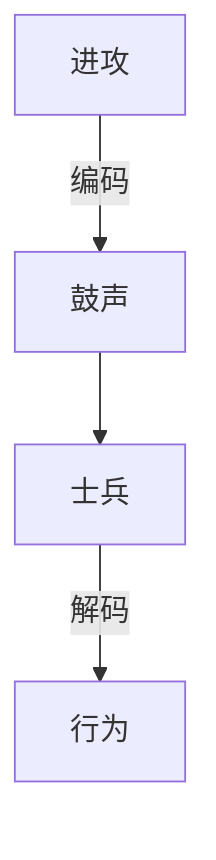

# python笔记-基本的数据类型                      <sub>  —storm</sub>

例子1

```python
# hello word program
print('hello word')
```

[开发相关的网站推荐](https://stackoverflow.com/) https://stackoverflow.com/

## Charpter1:基本的对象类型

> 对象的三个维度：身份，类型，值

### 1.1 数字

#### 1.1.1 数字

* 内建函数id()可以查看对象的内存地址（==身份==），不可修改`id(3)`。
* 内建函数Type()可以查看对象的==类型==，可修改。`type(3)`。
* 对象的值即是它==本身==。

#### 1.1.2 变量

`x=5`,x即是变量，5是对象。==对象有类型，变量无类型==。

#### 1.1.3 简单的四则运算

```python
>>>2+5
7
>>>5-2
3
>>>5*2
10
>>>10/5+1
3
```

#### 1.1.4 整数溢出问题

> python支持==无限精度==的整数，不用考虑整数溢出问题。

### 1.2 除法

#### 1.2.1 整数与整数相除

```python
>>>2/5
0.4
>>>2.0/5
0.4
>>>2/5.0
0.4
>>>2.0/5.0
0.4
```

==在python2.x中 ，2/5得到是商==。

#### 1.2.2 浮点数与整数相除

```python
>>>9.0/2
4.5
>>>9/2.0
4.5
```

==在python2.x，不管是除数还是被除数是浮点数，结果总是浮点数。在python3.x，结果都是浮点数==。

在除法中还会存在结果”不准确“的情况。

```python
>>>10/3
3.3333333333333335
```

#### 1.2.3 引入模块解决出发问题

```python
>>>from _future_ import division
```

==在 python 2.x引入该模块，所有的运算结果都是浮点数==。

#### 1.2.4 余数

```python
>>>5%2
1
```

使用内建函数divmod()可以同时得到商和余数。

```python
>>>divmod(5,2)
(2,1)
```

<u>==结果是以元组形式返回==</u>。

#### 1.2.5 四舍五入

使用内建函数 round()进行四舍五入运算。

```python
>>>round(1,234567,2)
1.23
```

round(x,y)，其中的第二个 参数y表示要保留的小数位数。

例外：

```python
>>>round(1.2345,3)
1.234
```

==结果不是1.235==。

### 1.3 常用的数学函数和运算优先级

> python 中 的math库可以实现乘方、开方、对数运算等复杂运算，math库是python的标准库。

#### 1.3.1 使用math 模块 

```python
>>>import math
>>>math.pi
3.141592653589793
```

dir(module)是一个非常有用的指令，可以通过它查看任何模块中所包含的工具。`dir(math)`

```>>>help(math.pow)
>>>help(math.pow)
Help on built-in function pow in module math:

pow(x, y, /)
    Return x**y (x to the power of y).
```

结果解释：

* 第一行的意思是说这里是 math模块的内建函数pow的帮助信息。
* 第三行表示这个函数的参数，有两个，也是函数的调用方式。
* 第四行是对函数的说明，返回x**y的结果，并且在后面解释了含义。

```python
>>>4**2
16
>>>math.pow(4,2)
16
```

其他示例：

```python
>>>math.sqrt(9)
3.0
>>>math.floor(3.14)
3
>>>math.fabs(-2)
2
>>>abs(-2)
2
>>>math.fmod(5,3)
2
```

#### 1.3.2 运算优先级 

|      运算符      |       描述       |
| :--------------: | :--------------: |
|      lambda      | Lambda 的表达式  |
|        or        |    布尔 “或”     |
|       and        |    布尔 “与”     |
|      not x       |    布尔 “非”     |
|    in, not in    |     成员测试     |
|    is, is not    |    同一性测试    |
| <,<=,>,>=,!=,=== |       比较       |
|        \|        |      按位或      |
|        ^         |     按位异或     |
|        &         |      按位与      |
|      <<, >>      |       移位       |
|       +，-       |    加法与减法    |
|      *,/,%       | 乘法，除法与取余 |
|      +x,-x       |      正负号      |
|        ~x        |     按位翻转     |
|        **        |       指数       |

==括号==，只要有括号，就先计算括号内的。

### 1.4 第一个简单的程序

> 程序是指令的集合

```python
# 注释：第一个程序 。
>>>print('hello  world')
```

* 单行注释可以用“#”开头；
* 多行注释，用一对''' '''(三个单引号)包裹起来

> 语句和程序的区别：语句就是告诉程序要做什么事情；程序是由各种各样的语句组成的。

> 语句和表达式的区别：表达式就是某件事，语句是做某件事。

### 1.5 字符串

#### 1.5.1 字符串

字符串（string）,是由零个或多个字符组成的有限串行。在python中，万物皆对象。字符串通常有单引号或双引号包裹起来。

```python
>>>'i love python'
'i love python'
```

例子：关于字符串what's you name?错误解析。

```python
>>>'what's your name?'
SyntaxError: invalid syntax
```

> 三个单引号会报错。

- 解决办法一：双引号包裹单引号

```python
>>>"what's your name?"
"what's your name?"
```

- 解决办法二：使用转义符（\）

```python
>>>'what\'s your name?
"what's your name?"
```

转义符的作用是让某个符号不在表示某种含义，而是表示另外一种含义。可以让''转变成字符串的一部分。

#### 1.5.2 变量和字符串

在python中"变量无类型，对象有类型"。变量相当于一个标签，贴在了不同的对象上。这种"贴"的动作，可以通过复制语句完成。

同样，对字符串类型的对象也是这样，能够通过赋值语句，将对象与某个标签（变量）关联起来。

```python
>>>b='hello world'
>>>b
'hello world'
>>> print(b)
hello world
```

==直接输出b和打印b的结果是不同的==。

#### 1.5.3 连接字符串

```python
>>>'pyth'+'on'
'python'
```

> 四则运算中，只有加法可用。

```python
>>>a=1990
>>>b='python'
>>>print(b+a)
Traceback (most recent call last):
  File "<pyshell#18>", line 1, in <module>
    print(a+b)
TypeError: unsupported operand type(s) for +: 'int' and 'str'
```

报错是由于"+"连接的是不同的类型（int 和 str）

***"+"连接的必须是相同的数据类型。***

解决办法：

```python
>>>a=1990
>>>b='python'
>>>print(b+str(a)
python1990
```

或

```python
>>>a=1990
>>>b='python'
>>>print(b+repr(a))
python1990
```

其实repr()是反引号``的替代品，它能够将结果字符串转化为合法的python表达式。

#### 1.5.4 转义字符

在字符串中，有时需要输入一些特殊的符号，但是，某些符号不能直接输出，就需要用转义字符。所谓转义，就是不采用符号本来的含义，而采用另外一种含义。下面列出常用的转义符。

| 转义字符 |                       描述                        |
| :------: | :-----------------------------------------------: |
|    \     |                 (在行尾时)续行符                  |
|    \     |                    反斜杠符号                     |
|    \'    |                      单引号                       |
|    \"    |                      双引号                       |
|    \a    |                       响铃                        |
|    \b    |                 退格（Backspace）                 |
|    \e    |                       转义                        |
|   \000   |                        空                         |
|    \n    |                       换行                        |
|    \v    |                    纵向制表符                     |
|    \t    |                    横向制表符                     |
|    \r    |                       回车                        |
|    \f    |                       换页                        |
|   \oxy   |  八进制数，yy代表的字符，例如 ：==\o12代表换行==  |
|   \xyy   | 十六进制数，yy代表的字符，例如 ：==\x0a代表换行== |
|  \other  |             其他的字符以普通格式输出              |

note:标黄部分需要进一步求证。

#### 1.5.5 原始字符串

例子-如何正确打印文件路径：

```python
>>>dos=r"c:\news"
>>>print(dos)
c:\news
```

或：

```python
>>>dos="c\\news"
>>>print(dos)
c:\news
```

r开头引起的字符串就是声明了后面引号里的东西是原始字符串，在里面放任何字符都表示该字符的原始含义。

#### 1.5.6 input和print

* input返回的值都是str类型
* print的返回值默认是以\n结尾的。所以每个输出语句之后自动换行。

例子 ：

```python
>>>name=input('what's your name?)
>>>age=input('how old are you?')
>>>print("Your name is ",name)
>>>print('You are '+age+'years old')
>>>after_ten=int(age)+10
>>>print('you will be '+str(after_ten)+" years old after tne years")
```

#### 1.5.7 索引和切片

字符串属于==有序排列==的序列类型。字符串的编号叫做索引。

```python
>>>a='study python'
>>>a[0]
's'
>>>a[1]
't'
>>>a[5]
''
```

> ==a[5]不是''p',而是' '.空格本身也算字符串的一部分==。

字符串的索引顺序

|  0   |  1   |  2   |  3   |  4   |  5   |  6   |  7   |  8   |  9   |  10  |  11  |
| :--: | :--: | :--: | :--: | :--: | :--: | :--: | :--: | :--: | :--: | :--: | :--: |
|  s   |  t   |  u   |  d   |  y   |      |  p   |  y   |  t   |  h   |  o   |  n   |
| -12  | -11  | -10  |  -9  |  -8  |  -7  |  -6  |  -5  |  -4  |  -3  |  -2  |  -1  |

`a.index[p]` 6 通过字符找索引

* 切片

```python
>>>a[6:11]
'python'
>>>a
'study python'
>>>b=a[1:] #得到从1号到最末尾的字符
>>>b
'tudy python'
>>>c=a[:] #得到所有字符
>>>c
'study python'
>>>a[:10] #得到从第一个到10号之前的字符
'study pyth'
>>>a[::-1] #逆序显示
'nohtyp yduts'
```

* python中`c=a[:]`和`c=a`并没有生成新的字符串，只是将c这个标签贴到了a指向的字符串对象，可以用id()方式查看两个变量的内存地址（身份）。

#### 1.5.8 基本操作

所有序列都有如下基本操作，字符串是==序列==的子集。

- len():返回序列长度
- +：连接两个序列
- *：重复序列元素
- in:判断元素是否存在与序列中
- max():返回最大值
- min():返回最小值
- cmp(str1,str2):比较两个序列是否相同

例子：

* "+"连接字符串

```python
>>>str1='苏州'
>>>str2='吴中'
>>>str1+str2
'苏州吴中'
>>> str1+'-->'+str2
'苏州-->吴中'
```

> ==不要 小看“+”号，到此只是学了字符串这一种序列，后面还会遇到列表、元组两种序列，都能够实现如此拼接。==


* in

```python
>>>'苏'in str1
True
>>>'学' in str1
False
```

>==in 用来判断某个字符串是否在另外一个字符串中，或者判断某个字符串内是否包含某个字符串，如果包含，就返回True,否则返回False。==

* 最值

```python
>>>max(str1)
'苏'
```

> ==在一个字符串中，每个字符串在计算机内都是有编码的，也就是对应一个数字（ASCII值），min()和max()就是根据这些数字获得最小值和最大值，然后对应出相应的字符。chr(数字)可找到数字对应的字符，ord(字符 )可找到字符对应的数字。==

* 比较 

```python
>>>cmp(str1,str2)
```

返回值小于0，说明第一个小于第二个；返回值等于0，说明相等；返回值大于0，说明第一个大于第二个 。在字符串的比较中，两个字符串的第一个字符串先比较，如果相等，就比较下一个，如果不相等，就返回结果。

```python
>>>cmp('123','23')
-1
>>>cmp(123,23) #也可以直接比较整数，这时候就是整数之间的直接比较了。
1
```

* *

  字符串中的 '*'是重复那个字符串，在某些时候是很好用的，比如要打印一个华丽的分割线：`print'-' *20`

* len()

用来查看某个字符串中有多少个字符，即计算字符长度。

```python
>>>a='hello'
>>>len(a)
5
```

#### 1.5.9 常用的字符串方法

可以使用`dir(chr)`查看字符串的方法。

* split()

其作用是把字符串根据某个分隔符进行分割。

```python
>>>a='i love python'
>>>a.split('') #使用空格分割字符串
['i','love','python'] #列表
```

* 去掉字符串两头的空格

  1. `s.strip():`去掉字符串左右空格
  2. `s.lstrip():`去掉字符串左边空格
  3. `s.rstrip():`去掉字符串右边空格

  

  例子：

  ```python
  >>>b=' hello '#两边都有空格
  >>>b.strip()
  'hello'
  ```

  ==但是b本身的值并没有发生变化，还是' hello '。==

* 字符串大小的转化

  1. s.upper()
  2. s.lower()
  3. s.capitalize()
  4. s.isupper()
  5. s.islower()
  6. s.istitle()

  ```python
  >>>s='python'
  >>>s.upper() #将小写字母完全变成大写字母
  'PYTHON'
  >>>s #原始数据对象并未发生改变
  'python'
  >>>b=s.upper()
  >>>b
  'PYTHON'
  >>>s.capitalize() #将字符串的第一个字母变成大写
  'Python'
  >>>s #原始对象未改变 
  'python'
  >>>s.istitle()
  False
  >>>s='Python'#当字符串中的每个首字母同时都是大写是返回True
  >>>s.istitle()
  True
  >>>s='i love python'
  >>>s.title()
  'I Love Python'
  >>>s.islower()
  False
  >>>s='python'
  >>>s.islower()
  True
  ```

* join连接字符串

用"+"能够连接字符串，但不是什么情况下都能够如愿。比如 ，将列表（列表是另外一种类型）中的每个字符（串）元素拼接成一个字符串，并且用某个符号连接，但如果用"+"会比较麻烦。用字符串的join方法就比较容易实现。

```python
>>>b
'www.itdiffer.com'
>>>c=b.split('.')
>>>c
['www','itdiffer','com']
>>>'.'join(c)
'www.itdiffer.com'
>>>'*'join(c)
'www*itdiffer*com'
```

#### 1.5.10 字符串格式化输出

> ==字符串格式化就是要制定一个模板，在这个模板中某个或者几个地方留出空格来，然后在那些空位填上字符串。那些空位需要一个符号来表示，这个符合通常被叫做占位符（仅仅是占据着那个位置，并不是输出的内容）。==

```
>>>'i like %s'%'python'
'i like python'
```

| 占位符 |            说明            |
| :----: | :------------------------: |
|   %s   | 字符串（采用str()的显示 ） |
|   %r   | 字符串（采用repr()的显示） |
|   %c   |          单个字符          |
|   %b   |         二进制整数         |
|   %d   |         十进制整数         |
|   %e   |      指数（底数为e）       |
|   %f   |           浮点数           |

例子：多个占位符 

```python
>>>print('suzhou is more than %d years.%s lives in here'%\(2500,'孙权'))
suzhou is more than 2500 years.孙权 lives in here
```

==浮点数字的打印输出，还可以限定输出的小数位数和其他样式：==

```python
>>>print("today's temperature is %.2f"%12.234)
today's temperature is 12.23
```

> 目前python3.x 中用的是string.format()格式化方法。

```python
>>>s1='i like {}'.format('python')
>>>s1
'i like python'
>>>s2='suzhou is more than {0} years.{1}lives in \here.'.format(2500,'孙权')
>>>s2
'suzhou is more than 2500 years.孙权 lives in here'
```

==这里的{}是作为占位符使用的。==只需要将对应的东西按照顺序放到format后面的括号中排列好，分别对应占位符{}即可。

```python
>>>print('suzhou is more than {year} years.{name}lives in here'.format(year=2500,name='孙权'))
suzhou is more than 2500 years.孙权 lives in here.
```

> 字典格式化方法

``` python
>>>lang='python'
>>>print('i  love %(program)s'%{'program':lang}
i love python
```

#### 1.6.1 编码



#### 1.6.2 计算机中的字符编码 

unicode（万国码、国际码、统一码、单一码）是计算机科学领域内的一项业界标准。它对世界上大部分的文字系统进行了整理、编码，使得电脑可以用更为简便的方式来呈现和处理文字。

unicode的实现方式称为Unicode转换格式（UTF），UTF-8是一种可以针对Unicode的可变长度字符编码，也是一种前缀码。它可以用来表示Unicode标准中的任何字符，且其编码中的第一个字节仍与ASCII兼容。

####  1.6.3 避免中文是乱码

- 提倡使用utf-8编码方案
- t提倡使用python3.x

### 1.7 列表

**==list 在 python中具有非常强大的功能==**

#### 1.7.1 定义

在python中用[]表示一个list，方括号里面的元素类型，可以是int,也可以是str类型的数据甚至也可以是True/False这种布尔值。

```python
>>>a=[] #定义了一个空的列表，变量a相当于一个贴在其上的标签
>>>type(a)
<type'list'> #利用内置函数type()查看变量a引用对象的类型，为list
>>>bool(a)  #利用内置函数bool()看看a的布尔值，因为是空的，所以为False
False
>>>print(a) #打印 
[]
```

bool()是一个布尔函数，在后续章节中会详述。它的作用是来判断一个对象是‘真’还是'假'（空）。

```python
>>>a=['2',3,'孙权']
>>>a
['2',3,'孙权']
>>>type(a)
<type 'list'>
```

一个列表中能够容纳多少东西，'有容乃大'是对列表最好的形容了，它的大小仅受制于硬件设备和你的意愿。

#### 1.7.2 索引和切片

```python
>>>a=['2',3,'孙权']
>>>a[2]
'孙权'
>>>a[0] #索引号也是从0开始
'2'
```

列表和字符串两种类型都属于序列。

#### 1.7.3 反转

```python
>>>a=['2',3,'python']
>>>a[::-1] #并不改变原a列表
['python',3,'2']
```

`list(reversed(a))` 会将原列表改变

#### 1.7.4 对list的 操作

1. len()

```python
>>>a=['2',3,'python']
>>>len(a)
3
```

2. +,连接两个序列

```python
>>>a=[1,2,3]
>>>b=['python']
>>>a+b
[1,2,3,'python']
```

3. *,重复元素 

```python
>>>a=[1,2,3]
>>>a*3
[1,2,3,1,2,3,1,2,3]
```

4.  in

```python
>>>a=[1,2,3]
>>>1 in a
True
```

5. max()和 min()

```python
>>>a=[2,3,1]
>>>max(a)
3
>>>min(a)
1
```

6. cmp()

```python
>>>a=[3,2]
>>>b=[3,4]
>>>cmp(a,b)
-1
```

7. 追加元素 

```python
>>>a=[1,2,3]
>>>a.append(4)
>>>a
[1,2,3,4]
>>>a[4]=5
>>>a
[1,2,3,4,5]
```

==两种追加新元素的方式是等价的。==

#### 1.7.5 列表的函数

- append和extend

```
>>>a=[1,2,3]
>>>b=[4,5,6]
>>>a.append(b)
>>>a
[1,2,3,4,5,6]
```

extend的对象是list,当extend(str)的时候，str被以字符为单位拆开，然后追加到列表中。如果extend的对象是数值型，则会报错。

```python
>>>a=[1,2,3]
>>>b='abc'
>>>a.extend(b)
>>>a
[1,2,3,'a','b','c']
>>>c=5
>>>a.extend(c)
Traceback (most recent call last):
File "<stdin>", line 1, in <module>
TypeError: 'int' object is not iterable
```

==list.extend(L)=list[len(list):]=L,L是待并入的List。==

extend函数是将另外的元素增加到一个已知的列表中，元素必须是可迭代的。

可以用hasattr()判断一个对象是否是可迭代对象。

```python
>>>a=[1,2,3]
>>>hasattr(a,'_iter_')
False
```

列表的extend方法会直接修改原列表，列表的身份（内存地址）不变。

append()方法和extend()方法类似，也是原地修改列表，两者的共同点如下：

- 都是原地修改列表。
- 原地修改不返回值。

两者也有不同之处,见以下实例：

```python
>>>a=[1,2,3]
>>>b=[4,5,6]
>>>a.extend(b)
>>>a
[1,2,3,4,5,6] #extend的结果
>>>c=[1,2,3]
>>>d=[4,5,6]
>>>c.append(d)
>>>c
[1,2,3,[4,5,6]]#append的结果
```

==append()是整建制地追加，extend()是个体化扩编。==

- count

count的作用是统计某个元素在list中出现的次数，也就是某个元素的个数。

```python
>>>a=[1,2,3,1,1,12]
>>>a.count(1)
3
>>>a.count(4)
0  #不报错，返回的值是0
```

- index

```python
>>>a=[1,2,3,1,2,1,1,1]
>>>a.index(1)
0 #当列表中存在多个相同的元素时，返回第一个位置。
```

- insert

实现追加和插入元素的功能。list.insert(i,x),其中i是将元素插入到列表中的位置，即将x插入到索引值是i的元素的前面。

```python
>>>a=[1,2,3,4]
>>>a.insert(3,5)
>>>a
[1,2,3,5,4]
>>>a.insert(5,6)
>>>a
[1,2,3,5,4,6] #追加功能
```

- pop和remove  删除元素的办法

list.remove(x):删除列表中的==第一个x元素==，若没有该元素则报错。

list.pop([i])：删除指定位置的元素，若未指定索引，则删除最后一个元素 。

```python
>>>a=[1,2,3,4,5,5,6]
>>>a.remove(5)
>>>a
[1,2,3,4,5,6] #删除第一个元素5
>>>a.pop()
6 #删除最后一个元素并返回
>>>a.pop(0)
1
```

- list remove(x)
  - 如果正确删除，不会有任何反馈，没有消息就是好消息，因为是对列表进行原地修改。
  - 如果所删除的对象不再list中，就报错。
- reverse

就是把列表中的元素反过来 。是原地反过来 ，不生成新的列表，所以没有返回值。

```python
>>>a=[1,2,34]
>>>a.reverse()
>>>a
[34,2,1]
```

- sort

sort 是对列表进行排序。

```python
>>>a=[37,42,3]
>>>a.sort()
[3,37,42]
```

list.sort()也是对列表进行原地修改，没有返回值，==在该方法中还有一个参数key,即按关键字排序。==

### 1.8 比较列表和字符串

####  1.8.1 相同点 

两者都属于序列类型，那些属于序列的操作对两者都适用。

序列的每一个元素都可以通过指定一个编号（偏移量或索引值）的方式得到。偏移量或索引值从0开始，到总元素数减1结束。

```python
>>>a='welcome you'
>>>a[1]
'e'
>>>b='abc'
>>>b*3
'abcabcabc'
>>>c=['ab','bc','cd']
>>>c[1]
'bc'
```

#### 1.8.2 区别

列表和字符串最大的区别是：列表是可以改变，字符串不可变 。

```python
>>>a='python'
>>>a[1]='b'
Traceback (most recent call last):
  File "<pyshell#5>", line 1, in <module>
    a[1]='b'
TypeError: 'str' object does not support item assignment
```

#### 1.8.3 多维列表 

在字符串中，每个元素只能是字符，在列表中，元素可以是任何类型。

```python
>>>matrix=[[1,2,3],[4,5,6],[7,8,9]]
>>>matrix[0][1]
2
>>>matrix2=[[1,2,3],['a','b','c'],'d','e']
>>>matrix[1][1]
'b'
>>>matrix[2]
'd'
```

#### 1.8.4 列表和字符串的互相转化 

1. str.split()

这个内置函数实现的是将str转化为list。其中str=""是分隔符。`help(str.split)`

```python
>>>line='hello. i am python'
>>>line.split('.') #以英文的句点为分隔符
['hello','i am python']
>>>line.split('.',1) #1指maxsplit
['hello','i am python']
>>>name='Albert Ainstain'
>>>name.split(" ") #使用空格作为分隔符
['Albert','Ainstain']
```

==让人眼前一亮的用法==

```python
>>>s='i am, writing\npython\tbook on line' #这个字符串中有空格，逗号，换行等符号.
>>>s.split() #用split(),但是括号中不输入任何参数。
['i','am','writing','python','book','on','line']
```

如果split()不输入任何参数，显示就是见到任何分割符号，就用其分割了。

#### 1.8.5  “[seq]”.join(list)

join 是split的逆运算。

```python
>>>name=['Albert','Ainstain']
>>>"".join(name)
'AlbertAinstain'
>>>"."join(name)
'Albert.Ainstain'
>>>" ".join(name)
"Albert Ainstain"
```

```python
>>>s="I am, writing\npython\tbook on line"
>>>print(s)
I am,writing
python book on line
>>>s.split()
['i','am,','writing','python','book','on','line']
>>>" ".join(s.split()) #重新连接，但am后面逗号还是存在的。
'I am, writing python book on line'
```

### 1.9 元组

#### 1.9.1 定义

```python
>>>s='abc'
>>>s
'abc'
>>>t=123,'abc',['come','here']
>>>t
(123,'abc',['come','here']) #元组
```

元组使用括号括起来的，元素之间用逗号隔开，元组中的元素可以是任何 python对象类型。

元组也是一种序列，这一点与列表、字符串类似。它的特点是其中的元素不能更改，这一点与列表不同，与字符串类似；它的元素可以是任何数据类型，这一点与列表相同，但不同于字符串。

```python
>>>t=1,'23',[123,'abc'],('python','learn') #元素多样性
>>>t
(1,'23',[123,'abc'],('python','learn'))
>>>t[0]=8 #元组不能修改(包括追加等操作)
Traceback (most recent call last):
File "<stdin>", line 1, in <module>
TypeError: 'tuple' object does not support item assignment
```

#### 1.9.3 索引和切片

==元组也是序列类型==

```python
>>>t=1,'23',[123,'abc'],('python','learn')
>>>t[2]
[123,'abc']
>>>t[2][0]
123
```

> 如果元组中只有一个元素的话，应该在该元素后面加一个英文逗号,。

```python
>>>a=(3)
>>>type(a)
<type 'int'>
>>>b=(3,)
>>>type(b)
<type 'tuple'>
```

使用list()和tuple()可以将列表和元组进行转化。

```python
>>>t=1,'23',[123,'abc'],('python','learn')
>>>z=list(t)
[1,'23',[123,'abc'],('python','learn')]
>>>t_tuple=tuple(z)
>>>t_tuple
(1,'23',[123,'abc'],('python','learn'))
```

#### 1.9.3 用途

- 元组比列表操作速度快。如果定义了一个值的常量集，并且唯一要用它做的是不断地遍历它，请使用元组代替列表。
- 如果对不需要修改的数据进行"写保护"，可以使用元组而不是列表。如果必须要改变这些值，则需要执行元组到列表的转换。
- 元组可以在字典中被用作key,但是列表不行。因为字典的key必须是不可变的，元组本身是不可改变的。
- 元组可以用在字符串格式化中。

### 1.10 字典

例子：假设有一种需要，要储存城市和电话区号。

```python
>>>city=['suzhou','tangshan','beijing','shanghai']
>>>city_codes=['0512','0315','011','012']
>>>print("{0}:{1}".format(city[0],city_codes[0]))
suzhou:0512
```

*这里的区号用的是字符串类型，而不是整数型，使用整数型会输出8进制*

#### 1.10.1 创建字典 

- 创建一个空字典，然后可以加入新东西。

```python
>>>dict={}
>>>dict
{}
```

- 创建一个非空字典。

```python
>>>dict1={'a':1,'b':2,'c':3}
>>>dict1
{'a':1,'b':2,'c':3}
```

'a':1叫做键值对，前面的a叫做键（key），后面的1是前面的键name所对应的值（value）。在一个字典中，键是唯一的，不能重复。值则对应于键，且值可以重复。键值之间用英文的冒号，每一个键值对之间用英文的逗号隔开。

增加键值对的方法：

```python
>>>dict1['d']=4  #增加键值对的方法
>>>dict1
{'a':1,'b':2,'c':3,'d':4}
```

==字典是否可以原地修改呢？即字典增加值以后，那个字典对象还是原来的内存地址吗？==列表可以原地修改 ，因为列表是可变的，字符串和元组不行，因为它们是不可变的。

```python
>>>a={}
>>>id(a)
2166818036760
>>>a['a']=1
>>>a
>>>id(a)
2166818036760
```

以上的例子表明，字典可以原地修改，即它是可变的。

- 利用元组构建字典。

```python
>>>a=(['first',1],['second':2])
>>>b=dict(a)
>>>b
{'first':1,'second':2}
>>>c=dict(third=3,fourth=4])
>>>c
{'third':3,'fourth':4}
```

- 使用fromkeys。

```python
>>>website={}.fromkeys(('third','forth'),'facebook')
>>>website
{'third':'facebook','forth':'facebook'}
```

```python
>>>dd={(1,2):1}
>>>dd
{(1,2):1}
>>>dd={[1,2]:1}
Traceback (most recent call last): 
  File "<pyshell#8>", line 1, in <module>
    dd={[1,2]:1}
TypeError: unhashable type: 'list' #列表是可变类型，不能作为字典的值 
```

### 1.10.2 访问字典的值

字典类型的对象是以键值对的形式存储数据的，所以，只要知道键，就能得到值，这在本质上是一种映射关系。

```python
>>>a={'a':1,'b':2}
>>>a
{'a':1,'b':2}
>>>a['a']
1
```

“键”很关键，因为通过“键”能够增加“值”，通过“键”能够改变“值”，通过“键”也能访问到“值”。

在列表中，通过索引值可以得到某个元素，那么在字典中有索引吗？当然没有，因为它没有顺序，又哪里来的索引呢？所以，在字典中就不要什么索引和切片了。

#### 1.10.3 基本操作

- len(d)，返回字典（d）中的键值对的数量。
- d[key],返回字典（d）中的键(key)的值。
- d[key]=value,将值（value）赋给字典（d）中的键（key）。
- del d[key],删除字典（d）的键（key）项（将该键值对删除）。
- key in d,检查字典（d）中是否含有键为key的项。

```python
>>>a={'a':1,'b':2,'c':3,'d':4}
>>>len(a) #键值对数量
4
>>>a['e']=5 #赋值
>>>a
{'a':1,'b':2,'c':3,'d':4,'e':5}
>>>del a['a'] #删除字典元素
>>>a
{'b':2,'c':3,'d':4,'e':5}
>>>'a'in a #判断
False
```

#### 1.10.4 字符串的格式化输出

```python
>>>city_code = {"suzhou":"0512", "tangshan":"0315",\ "hangzhou":"0571"}
>>>" Suzhou is a beautiful city, its area code is %(suzhou)s" % \ city_code
' Suzhou is a beautiful city, its area code is 0512'
```

> 网页模板

> 在做网页开发的时候通常要用到模板，你只需要写好HTML代码，然后将某些部位空出来，等着Python后台提供相应的数据即可。当然，下面所演示的是玩具代码，基本没有什么实用价值，因为在真实的网站开发中，这样的知识很少用。但是，它绝非花拳绣腿，而是你能够明了其本质，至少了解到一种格式化方法的应用。

```python
>>>temp = "<html><head><title>%(lang)s<title><body><p>My name is %(name)s.</p> </body></head></html>"
>>> my = {"name":"qiwsir", "lang":"python"}
>>> temp % my
'<html><head><title>python<title><body><p>My name is qiwsir.</p></body></head> </html>'
```

temp就是所谓的模板，双引号所包裹的实质上是一段HTML代码。然后在字典中写好一些数据，按照模板的要求在相应位置显示对应的数据。

#### 1.10.5 字典的函数

1. copy和deepcopy

```python
>>>a=5
>>>b=a  #对象有类型，变量无类型，变量只是一个标签。
>>>b
5
```

==通过赋值只是只是实现了所谓的假装拷贝==

```python
>>>a={'a':1,'b':2}
>>>id(a)
1609415613176
>>>b=a.copy
>>>id(b)
1609416095208
```

*copy方法能够生成一个与被复制对象相同的数据，但它在内存中开辟了另外一个空间。此时修改两者中的任意一个，都不会对对方造成影响。*

```python
>>>x={'a':1,'b':[1,23]}
>>>y=x.copy()
>>>y['b'].remove(23)
>>>x
{'a': 1, 'b': [1]} #x也发生了变化
```

深层的原因与Python存储的对象类型（在不少地方也用“数据类型”的说法，其实两者是一样的，“对象”和“数据”在Python中等同，不用区分）特点有关，Python只存储基本类型的数据，比如int、str，对于不是基础类型的，比如字典的值是列表，Python不会在被复制的那个对象中重新存储，而是用引用的式，指向原来的值。通俗地说，Python在所执行的复制动作中，如果是基本类型的数，就在内存中重新建个窝，如果不是基本类型的，就不新建窝了，而是用标签引用原来的窝。即如果比较简单，随便建立新窝即可；但是，如果对象太复杂了，就别费劲了，还是引用一下原来的省事。

把用copy()实现的拷贝称之为“浅拷贝”（不仅Python，很多语言都有“浅拷贝”。顾名思义，没有解决深层次问题。言外之意，还有能够解决深层次问题的方法）。与“浅拷贝”对应，在Python中，还有一个“深拷贝”（deep copy）。不过，要用import导入一个模块。

```python
>>>import copy
>>>x={'a':1,'b':[2,3]}
>>>y=copy.deepcopy(x) #深拷贝
>>>id(x['b'])
609416019656
>>>id(y['b'])
1609413189320 #此时列表已经被分配到了不同的内存。
>>>x['b'].remove(3)
>>>y
{'a':1,'b':[2,3]} #不会发生变化 
```

2. clear

在交互模式下，用help是一个很好的习惯 。

```python
>>>a={'a':1,'b':2}
>>>a.clear()
>>>a
{}
```

clear的含义是将字典清空，得到的是“空”字典 。它和del有着很大的区别，del是将字典删除，内存中就没有它了，并不是为“空”。

```python
>>>a={'a':1,'b':2}
>>>del a
>>>a
Traceback (most recent call last):
File "<stdin>", line 1, in <module>
NameError: name 'a' is not defined
```

>如果要清空一个字典，还能够使用a={}这种方法，但这种方法的本质是将变量a转向了{}这个对象，那么原来的呢？原来的成为了断线的风筝。这样的东西在
>Python中称之为垃圾，而且Python能够自动将这样的垃圾回收。读者就不用关心它了，正Python会处理的。

3. get和 setdefault

```python
>>>a={'a':1,'b':1}
>>>a.get('b')
1
>>>a['b']
1
>>>a.get('c') #键不在字典中返回None。
None
>>>a['c']  #键不在字典中会报错。
Traceback (most recent call last):
File "<stdin>", line 1, in <module>
KeyError: 'c'
```

```python
>>>a={'a':1,'b':2,'c':3}
>>>b=a.get('d','4')  #如果得不到键的值，可以返回设定的第二个返回值。
>>>b
4
>>>a
{'a':1,'b':2,'c':3}
```

```python
>>>a={'a':1,'b':2,'c':3}
>>>a.setdefault('c') #键存在就返回它的值。
3
>>>a.setdefault('d',4) #键不存在就返回设定的返回值。
>>>a
{'a':1,'b':2,'c':3,'d':4}
>>>a.setdefault('e') #未设置第二个参数，返回None。
>>>a
{'a':1,'b':2,'c':3,'d':4,'e':None}
```

4. items/iteritems，keys/iterkeys，values/itervalues

D.items可以得到一个关于字典的列表，列表中的元素是由字典中的键和值组成的元组。

```python
>>>a={'a':1,'b':2,'c':3}
>>>b=a.items()
>>>b
[('a',1),('b',2),('c',3)]
```

5. pop和popitem

> list.remove(x)用来删除指定的元素，list.pop([i])用来删除指定索引的元素，如果不提供索引值，就默认删除最后一个。

D.pop(k[,d])是以字典的键为参数，删除指定键的键值对，当然，如果输入对应的值也可以，那个是可选的。

```python
>>>a={'a':1,'b':2}
>>>a.pop('b')
2
>>>a
{'a':1}
>>>a.pop() #pop中的参数不能省略，会报错。
Traceback (most recent call last):
File "<stdin>", line 1, in <module>
TypeError: pop expected at least 1 arguments, got 0    
```

如果要删除字典中没有的键值对，也会报错。

```python
>>>a={'a':1,'b':2}
>>>a.pop('c')
Traceback (most recent call last):
File "<stdin>", line 2, in <module>
KeyError: 'c'
```

> D.popitem()和list.pop()有相似之处，不用写参数(list.pop可以不写参数)，但是，D.popitem()不是删除最后一个，dict没有顺序，也就没有最后和最先了，它是随机删除一个，并将所删除的返回。但当字典本身为空时，D.popitem也会报错。

```python
>>>a={'a':1,'b':2}
>>>a.popitem()
('a':1) #删除是随机的，返回值是元组类，且其元素是所删除的键和值。
```

6. update

update的作用就是更新字典，其参数可以是字典或者某种可以迭代的对象。

```python
>>>a={'a':1,'b':2}
>>>b={'c':1}
>>>a.update(b)
>>>a
{'a':1,'b':2,'c':1}
>>>a.update([('d',4)]) #列表内的元素是元组
>>>a
{'a':1,'b':2,'c':1,'d':4}
```

7. has_key

这个函数的功能是判断字典中是否存在某个键。

```python
>>>a={'a':1,'b':2,'c':3}
>>>a.has_key('a')
True
```

### 1.11 集合

==在python中，对象类型本质上是自己可以定义的。==

> 各种对象类型都可以通过下述方法但不限于这些方法查到：
>
> - 交互模式下用dir()或者help()
> - 搜索引擎（Google）

对学过的对象类型做个归纳整理：

- 能够索引的，如list/str,其中的元素可以重复。
- 可变的，如list/dict，即其中的元素/键值对可以原地修改。
- 不可变的，如str/int,即不能进行原地修改。
- 无索引序列的，如dict,即其中的元素（键值对）没有排列顺序。

#### 1.11.1 创建集合

集合的英文是set,翻译过来是“集合”。它的特点是：有的可变，有的不可变，元素无次序，不可重复。

如果说元组（tuple）算是列表（list）和字符串（str）的杂合，那么集合（set）则是list和dict的杂合。

集合拥有类似字典的特点：可以用{ }花括号来定义：其中的元素没有序列，也就是非序列类型的数据，而且集合中的元素不可重复，这类似于dict。

集合也有一点列表的特点：有一种集合可以在原处修改。

```python
>>>sl=set('qiwsir')
>>>sl
{'q','i','s','r','w'}#将字符串中的字拆解开形成了集合，但sl中只有一个i,也就是集合中元素不能重复。
```

```python
>>>s2=set(['a','b','b','c','d'])
>>>s2
{'a','d','c','b'}#无重复元素，且显示的顺序与开始建立是不一样
```

```python
>>>s3={'google','baidu'}
>>>s3
{'baidu','google'}
```

==使用{ }创建集合的方式并不提倡，因为在某些情况下，python搞不清楚是字典还是集合。==

```python
>>>s1={'a','b',{'a':1,'b':1},123}
Traceback (most recent call last):
  File "<pyshell#8>", line 1, in <module>
    s1={'a','b',{'a':1,'b':1},123}
TypeError: unhashable type: 'dict'
>>>s2={'a','b',[123]}
Traceback (most recent call last):
  File "<pyshell#9>", line 1, in <module>
    s2={'a','b',[123]}
TypeError: unhashable type: 'list'
```

>认真阅读报错信息，有这样的词汇：“unhashable”，在理解这个词之前，先看它的反义词“hashable”，很多时候翻译为“可哈希”，其实它有一个不是音译的名词“散列”。如果我们简单点理解，某数据“不可哈希”（unhashable）就是其可变，如列表和字典都能原地修改，就是unhashable。否则，不可变的，类似字符串那样不能原地修改的就是hashable（可哈希）。

对于字典类型，其键必须是hashable,即不可变。

集合，其元素也是‘可哈希的’。上面的例子，试图将字典、列表作为元素的元素，就报错了。

```python
>>>s=set('google')
>>>s
{'g','l','e','o'}
>>>s[1]='i'
Traceback (most recent call last):
  File "<pyshell#12>", line 1, in <module>
    s[1]='i'
TypeError: 'set' object does not support item assignment
```

==集合不是序列类型，不能用索引方式对其进行修改==

类型名称函数能够实现类型转换，比如str()就是将对象转化为字符串，同理，分别用list()和set()能够实现集合和列表两种对象之间的转化。

```python
>>>s=set('google')
>>>sl=list(s)
>>>sl
['g','l','o','e']
```

特别说明，利用set()建立起来的集合是可变集合，可变集合都是unhashable类型的。

#### 1.11.2 集合的函数 

-  add和update

`a={}`的方式不能建立集合（set）。只能建立字典对象。

```python
>>>a=set()
>>>a.add('python') #增加一个元素，原地修改
>>>a
{'python'}
>>>a.add([1,2,3])#列表是不可哈希的，集合中的元素应该是hashable类型。
Traceback (most recent call last):
  File "<pyshell#5>", line 1, in <module>
    a.add([1,2,3])
TypeError: unhashable type: 'list'
>>>a.add('[1,2,3]')
>>>a
{'python','[1,2,3]'}
```

除了add()之外，还能够从另外一个集合中合并过来元素，方法是set.update(s2)。

```python
>>>a={'python','[1,2,3]'}
>>>b=set(['google'])
>>>a.update(b)
>>>a
{'python','[1,2,3]','google'}
```

- pop，remove，discard，clear

```python
>>>a={'python','[1,2,3]'}
>>>a.pop()#从集合中任意选一个删除，并返回该值
'python'
>>> a.pop('[1,2,3]')#如果指定删除某个元素就会报错
Traceback (most recent call last):
  File "<pyshell#8>", line 1, in <module>
    a.pop('[1,2,3]')
TypeError: pop() takes no arguments (1 given)
```

set.pop()是从集合中随机选一个元素删除并将这个值返回，但是不能指定删除某个元素。报错信息告诉我们，pop()不能有参数。此外，如果集合是空的了，再做pop()操作也报错。

```
>>>a={'a','b','c'}
>>>a.remove('a')
>>>a
{'b','c'}
>>>a.remove('d') #元素不存在就报错
Traceback (most recent call last):
File "<stdin>", line 1, in <module>
KeyError: 'd'
>>>a.discard('d')#元素不存在就什么都不做
```

在删除上还有一个绝杀，就是set.clear(),它的功能是 ：删除所有元素

#### 1.11.3 不变的集合

以set创立的集合都是可原地修改的集合，或者说是可变的，也就是unhashable.还有一种集合不能原地修改，这种集合的创建方法是用frozenset(),顾名思义这是一个被“冻结”的集合，当然是不能修改的。这种集合就是hashable类型—可哈希。

```python
>>>f=frozenset('python')
>>>f.add('python') #不可修改
Traceback (most recent call last):
  File "<pyshell#12>", line 1, in <module>
    f.add('python')
AttributeError: 'frozenset' object has no attribute 'add'
```

#### 1.11.4 集合的运算

- 元素与集合的关系，要么属于，要么不属于

```python
>>>a=set('python')
>>>a
{'o','n','p','y','h','t'}
>>>'z' in a
False
>>>'o' in a
True
```

- 集合与集合的关系

  - 等于

  ```python
  >>>a=set('python')
  >>>b=set('hello, python')
  >>>b
  {'n', 't', ',', 'y', 'e', ' ', 'l', 'h', 'o', 'p'}
  >>>a==b
  False
  >>>a!=b
  True
  ```

  - 子集

  ```python
  >>>a=set('python')
  >>>b=set('hello, python')
  >>>a<b #a是b的子集
  True
  >>>a.issubset(b)
  True
  >>>b.issuperset(a) #b是a的超集
  True
  ```

  - 并集

  ```
  >>>a={'a','b'}
  >>>b={'c','d'}
  >>>a|b
  {'a','b','c','d'}
  >>>a.union(b)
  {'a','b','c','d'}
  ```

  - 交集

  ```python
  >>>a={'a','b'}
  >>>b={'b','c'}
  >>>a&b
  {'b'}
  >>>a.intersection(b)
  {'b'}
  ```

  - 差集

  ```python
  >>>a={'a','b'}
  >>>b={'b','c'}
  >>>a-b
  {'a'}
  >>>a.difference(b)
  {'a'}
  ```

  - 对称差集

  ```python
  >>>a={'a','b'}
  >>>b={'b','c'}
  >>>a.symmetric_difference(b)
  {'a','c'}
  ```

  


